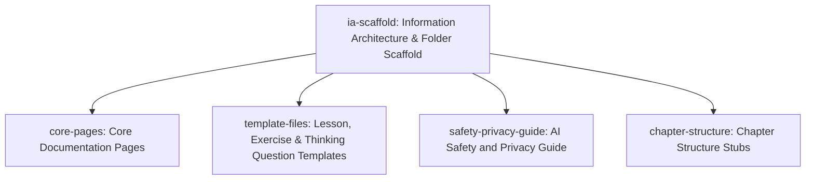

# Slice Dependency Graph: gitbook-documentation-tech-bridge

**Epic**: Create the initial GitBook documentation structure for Tech Bridge Book (multilingual ko/en/ja, information architecture, folder structure, and template files only).
**Created**: 2026-05-18

---

## Slice Summary

| Slice ID | Slice Name | Depends On | Safety Sensitive |
|----------|-----------|------------|-----------------|
| ia-scaffold | Information Architecture & Folder Scaffold | none | No |
| core-pages | Core Documentation Pages | ia-scaffold | No |
| template-files | Lesson, Exercise & Thinking Question Templates | ia-scaffold | No |
| safety-privacy-guide | AI Safety and Privacy Guide | ia-scaffold | No |
| chapter-structure | Chapter Structure Stubs | ia-scaffold | No |

---

## Dependency Diagram

---

## Batch Assignment

| Batch | Slice IDs | Parallel? | Rationale |
|-------|-----------|-----------|-----------|
| 1 | ia-scaffold | No | Foundation — all other slices write into the folder structure it creates |
| 2 | core-pages, template-files, safety-privacy-guide | Yes | No shared contracts between them; all depend only on Batch 1; no safety keywords matched; max 3 per batch |
| 3 | chapter-structure | No | Separated into its own batch to keep Batch 2 at the FR-022 limit of 3 parallel slices |

---

## Notes

- An edge from Slice A → Slice B means B cannot begin until A's contracts are frozen (committed, no further changes planned)
- Safety-sensitive slices always appear in their own sequential batch
- Max 3 slices per parallel batch (FR-022)
- `chapter-structure` has no logical dependency on Batch 2 slices but is placed in Batch 3 solely to respect the max-3 parallel limit
