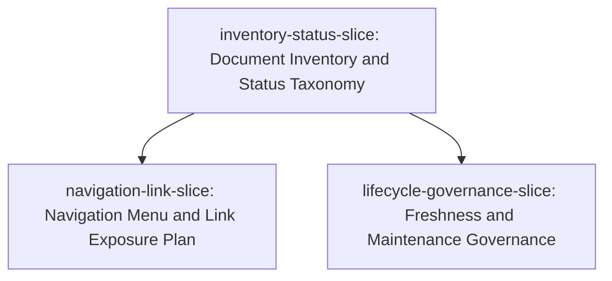

# Slice Dependency Graph: gitbook-spec-kit

**Epic**: 현재 프로젝트의 문서 시스템을 최신 기준으로 재정비하고, 문서 구조와 노출 방식을 최적화하기 위한 명세 작성
**Created**: 2026-05-28T09:03:11+09:00

---

## Slice Summary

| Slice ID | Slice Name | Depends On | Safety Sensitive |
|----------|-----------|------------|-----------------|
| inventory-status-slice | Document Inventory and Status Taxonomy | none | No |
| navigation-link-slice | Navigation Menu and Link Exposure Plan | inventory-status-slice | No |
| lifecycle-governance-slice | Freshness and Maintenance Governance | inventory-status-slice | No |

---

## Dependency Diagram

---

## Batch Assignment

| Batch | Slice IDs | Parallel? | Rationale |
|-------|-----------|-----------|-----------|
| 1 | inventory-status-slice | No | Establishes the shared document inventory, status taxonomy, and treatment vocabulary used by downstream slices. |
| 2 | navigation-link-slice, lifecycle-governance-slice | Yes | Both consume the frozen inventory/status contract and target different planning surfaces. Max parallel count is 2, under FR-022. |

---

## Notes

- An edge from Slice A to Slice B means B cannot begin until A's contracts are frozen.
- Shared contract: document inventory/status taxonomy, including update/delete/hold/archive/missing states and spec-kit relevance classification.
- Safety keyword source: `.agents/skills/speckit-guards/scripts/guard.sh`; `guard.sh --test` passed for all configured safety keywords.
