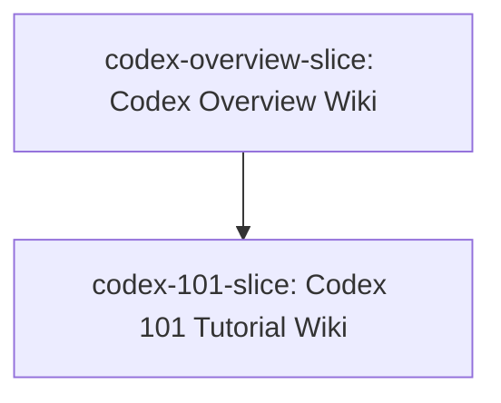

# Slice Dependency Graph: make-wiki-what

**Epic**: make Wiki, What is Codex and how to use it with document('https://openai.com/codex') and make wiki for codex 101
**Created**: 2026-05-18

---

## Slice Summary

| Slice ID | Slice Name | Depends On | Safety Sensitive |
|----------|-----------|------------|-----------------|
| codex-overview-slice | Codex Overview Wiki | none | No |
| codex-101-slice | Codex 101 Tutorial Wiki | codex-overview-slice | Yes |

---

## Dependency Diagram

The overview slice establishes the foundational wiki folder structure (`wiki/ko/codex/`, `wiki/en/codex/`) and the `wiki/index.md` entry for Codex. The 101 tutorial slice depends on that structure being in place before expanding into multi-page tutorial content.

---

## Batch Assignment

| Batch | Slice IDs | Parallel? | Rationale |
|-------|-----------|-----------|-----------|
| 1 | codex-overview-slice | No | Foundation slice; establishes wiki folder structure and index entry that Batch 2 depends on |
| 2 | codex-101-slice | No | Safety-sensitive (matched keyword: `authentication`); depends on Batch 1 completing first; must run sequentially per FR-007 |

---

## Notes

- An edge from Slice A → Slice B means B cannot begin until A's contracts are frozen (committed, no further changes planned)
- Safety-sensitive slices always appear in their own sequential batch
- Max 3 slices per parallel batch (FR-022)
- `codex-101-slice` matched the safety keyword `authentication` (the tutorial covers Codex authentication setup) and is therefore forced sequential regardless of dependency status
