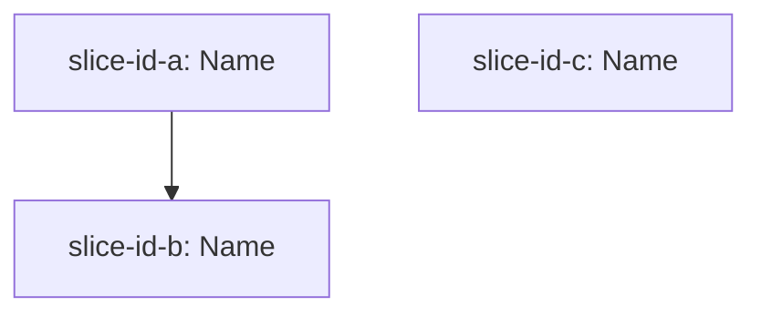

# Slice Dependency Graph: [EPIC-SLUG]

**Epic**: [Epic description]
**Created**: [DATE]

---

## Slice Summary

| Slice ID | Slice Name | Depends On | Safety Sensitive |
|----------|-----------|------------|-----------------|
| [slice-id-a] | [name] | none | No |
| [slice-id-b] | [name] | [slice-id-a] | No |
| [slice-id-c] | [name] | none | Yes |

---

## Dependency Diagram

*Replace with actual slice IDs and names. Remove this block if no dependencies exist.*

---

## Batch Assignment

| Batch | Slice IDs | Parallel? | Rationale |
|-------|-----------|-----------|-----------|
| 1 | [slice-id-a], [slice-id-c-if-safe] | Yes | No shared contracts, no safety conflict |
| 2 | [slice-id-b] | No | Depends on Batch 1 completing first |

---

## Notes

- An edge from Slice A → Slice B means B cannot begin until A's contracts are frozen (committed, no further changes planned)
- Safety-sensitive slices always appear in their own sequential batch
- Max 3 slices per parallel batch (FR-022)
